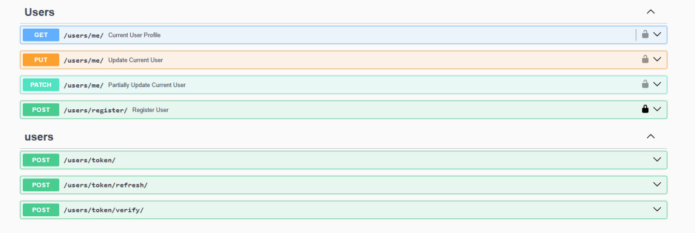
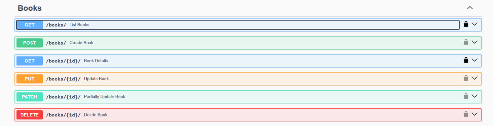
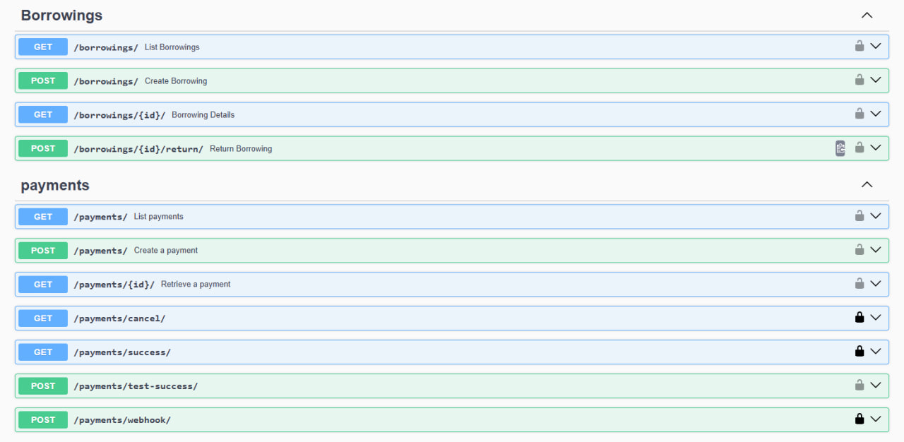
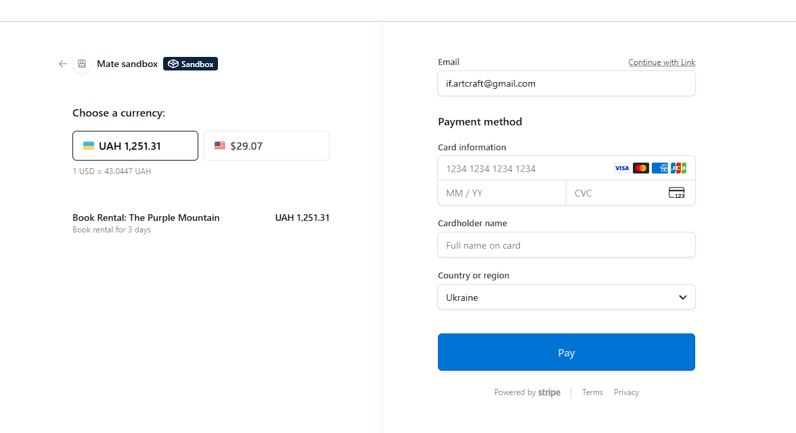
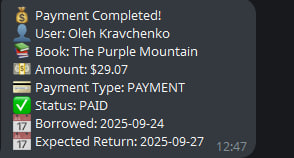
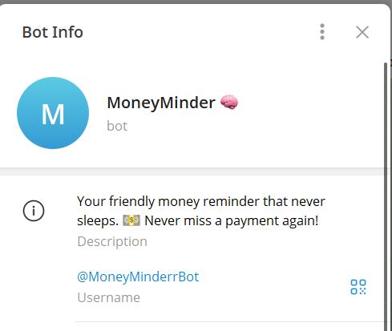
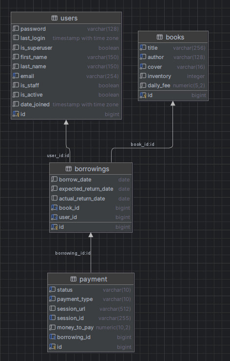

# 📚 Library Service API

**Library Service API** is a Django REST Framework project for managing a library system: books, users, borrowings, payments, and notifications.  
It replaces outdated paper-based tracking with a modern API-driven solution that supports inventory management, online payments, and automated notifications.

---

## 🚀 Features

- **Books Service**
  - CRUD operations for books (admin only for create/update/delete)
  - Automatic inventory updates on borrowing/returning
  - Public access to view books (even unauthenticated users)

- **Users Service**
  - Custom user model with email as the unique identifier
  - Registration, login, JWT authentication
  - Profile management (`/users/me/`)

- **Borrowings Service**
  - Borrow creation with inventory validation
  - Automatic decrease/increase of inventory
  - Prevents double returns
  - Filtering by `is_active`, `user_id` (for admins)

- **Payments Service (Stripe)**
  - Automatic Stripe Session creation on borrowing
  - Endpoints for `/success/` and `/cancel/`
  - Fine calculation for overdue returns

- **Notifications Service (Telegram)**
  - Notifications on new borrowings
  - Daily overdue checks
  - Implemented with Celery or Django-Q

- **API Docs**
  - Auto-generated Swagger / OpenAPI schema

---

## 🛠️ Tech Stack

- Python 3.12
- Django 5.2
- Django REST Framework
- PostgreSQL
- Redis
- Celery
- Docker & Docker Compose
- drf-spectacular (OpenAPI schema)
- Simple JWT (authentication)
- Stripe (payments)
- python-dotenv

---

## 🐳 Running the Project with Docker

### 1. Clone the Repository

```bash
git clone https://github.com/<your-username>/drf-library-api.git
cd drf-library-api
```

---

### 2. ⚙️ Environment Variables Setup

The project requires a `.env` file in the root directory.  
You can create it manually or copy from the template:

```bash
cp .env.sample .env
```

Then open `.env` and configure the following values:

#### Django
- `DEBUG` — set `True` for local development, `False` for production.
- `SECRET_KEY` — generate your own Django secret key:
  ```bash
  python -c 'from django.core.management.utils import get_random_secret_key; print(get_random_secret_key())'
  ```

#### Database
- `POSTGRES_DB` — name of the database (e.g., `library`)
- `POSTGRES_USER` — database username
- `POSTGRES_PASSWORD` — database password
- `POSTGRES_HOST` — database host (usually `db` in Docker)
- `POSTGRES_PORT` — default is `5432`

#### Stripe
- `STRIPE_SECRET_KEY` — create a **test API key** in your [Stripe Dashboard](https://dashboard.stripe.com/test/apikeys)
- `STRIPE_PUBLISHABLE_KEY` — optional, for frontend usage

#### Telegram
- `TELEGRAM_BOT_TOKEN` — create a bot via [BotFather](https://t.me/botfather)
- `TELEGRAM_CHAT_ID` — get your chat ID using [@userinfobot](https://t.me/userinfobot) or by adding the bot to a group

> 🔑 Keep `.env` private and **never commit it** to GitHub.

---

### 3. Build and Run

```bash
docker-compose up --build
```

📍 API will be available at:  
http://localhost:8000

---

## 🔐 Authentication

JWT-based authentication:

- `POST /users/token/` — obtain access and refresh tokens
- `POST /users/token/refresh/` — refresh the access token

Add the header to access protected endpoints:

```
Authorization: Bearer <your_access_token>
```

---

## 📚 API Endpoints

### Users Service
- `POST /users/register/` — register a new user
- `POST /users/token/` — obtain JWT tokens
- `GET /users/me/` — get profile info
- `PUT /users/me/` — update profile

### Books Service
- `GET /books/` — list books
- `POST /books/` — create a book (admin only)
- `PUT/PATCH /books/{id}/` — update a book (admin only)
- `DELETE /books/{id}/` — delete a book (admin only)

### Borrowings Service
- `POST /borrowings/` — create borrowing
- `GET /borrowings/` — list borrowings (filters: `is_active`, `user_id`)
- `GET /borrowings/{id}/` — get borrowing detail
- `POST /borrowings/{id}/return/` — return a book

### Payments Service
- `GET /payments/` — list payments
- `GET /payments/{id}/` — payment details
- `GET /payments/success/` — confirm Stripe payment
- `GET /payments/cancel/` — cancel payment

---

## 📚 API Documentation

- Swagger UI: [http://localhost:8000/api/docs/](http://localhost:8000/api/docs/)  
- OpenAPI schema (JSON): [http://localhost:8000/api/schema/](http://localhost:8000/api/schema/)

---

## 🧪 Running Tests

```bash
docker-compose exec app python manage.py test
```

---

## 📸 Screenshots








---

## 📊 DB Structure


